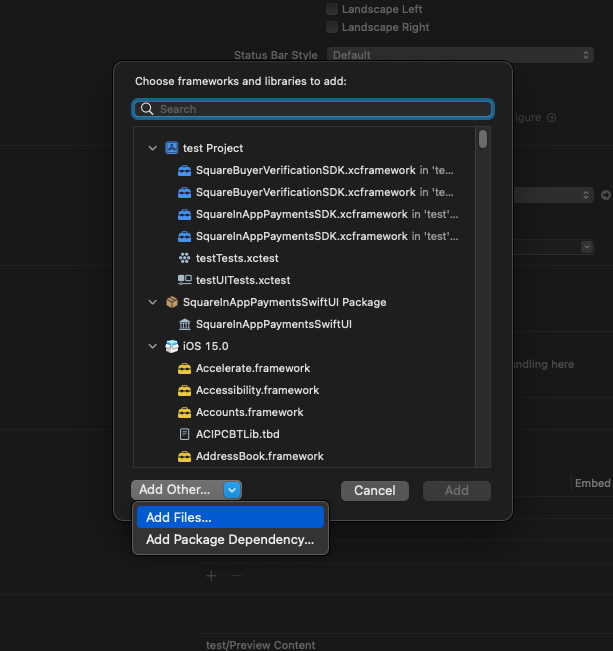
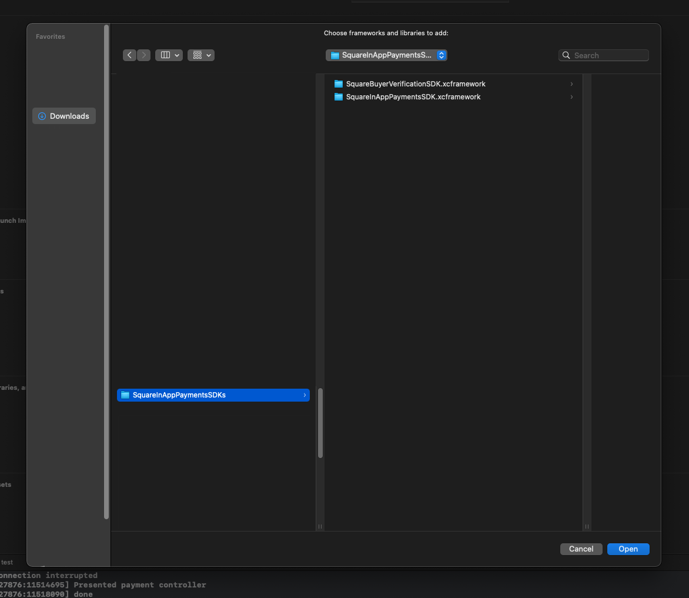

## Square In App Payments SDK SwiftUI

### 1) Install Square SDK Frameworks
First you must install the Square In App Payments SDK that everyone uses for Objective C and UIKit projects, you can add these 2 frameworks in several different ways however I will show you the best way to do it.

Please download the framworks from there github repository [(Click here for ZIP file)](https://github.com/square/in-app-payments-ios/releases/download/1.5.4/SquareInAppPaymentsSDKs.zip) or [(Here for for Repository Link)](https://github.com/square/in-app-payments-ios/).

### 2) Add Frameworks to Xcode Project

#### 1) 
#### 2) 
#### 3) 